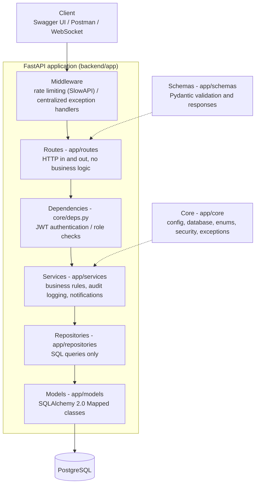
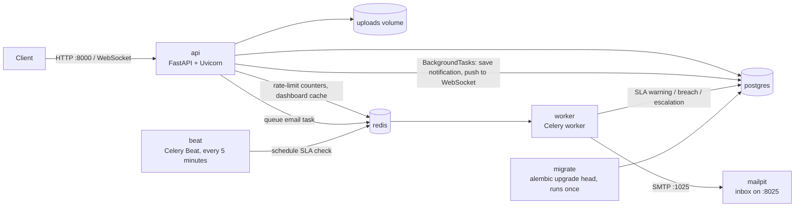
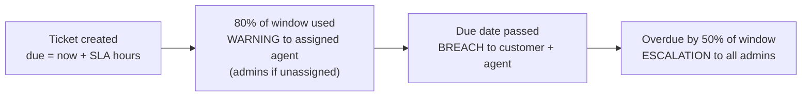

# Architecture

## 1. Layers (inside the API)

Each layer only talks to the one below it. Routes never touch the database.

```mermaid
flowchart TD
    Client["Client<br/>Swagger UI / Postman / WebSocket"] --> MW

    subgraph API["FastAPI application (backend/app)"]
        MW["Middleware<br/>rate limiting (SlowAPI) / centralized exception handlers"]
        R["Routes - app/routes<br/>HTTP in and out, no business logic"]
        D["Dependencies - core/deps.py<br/>JWT authentication / role checks"]
        S["Services - app/services<br/>business rules, audit logging, notifications"]
        Rep["Repositories - app/repositories<br/>SQL queries only"]
        M["Models - app/models<br/>SQLAlchemy 2.0 Mapped classes"]
        MW --> R --> D --> S --> Rep --> M
    end

    M --> DB[("PostgreSQL")]
    Sch["Schemas - app/schemas<br/>Pydantic validation and responses"] -.-> R
    Core["Core - app/core<br/>config, database, enums, security, exceptions"] -.-> S
```

## 2. Runtime (Docker Compose)

```mermaid
flowchart LR
    Client["Client"] -->|"HTTP :8000 / WebSocket"| API["api<br/>FastAPI + Uvicorn"]
    API --> PG[("postgres")]
    API --> Disk[("uploads volume")]
    API -->|"rate-limit counters, dashboard cache"| Redis[("redis")]
    API -->|"BackgroundTasks: save notification, push to WebSocket"| PG
    API -->|"queue email task"| Redis
    Redis --> Worker["worker<br/>Celery worker"]
    Beat["beat<br/>Celery Beat, every 5 minutes"] -->|"schedule SLA check"| Redis
    Worker -->|"SLA warning / breach / escalation"| PG
    Worker -->|"SMTP :1025"| Mail["mailpit<br/>inbox on :8025"]
    Migrate["migrate<br/>alembic upgrade head, runs once"] --> PG
```

## 3. SLA lifecycle

```mermaid
flowchart LR
    A["Ticket created<br/>due = now + SLA hours"] --> B["80% of window used<br/>WARNING to assigned agent<br/>(admins if unassigned)"]
    B --> C["Due date passed<br/>BREACH to customer + agent"]
    C --> D["Overdue by 50% of window<br/>ESCALATION to all admins"]
```